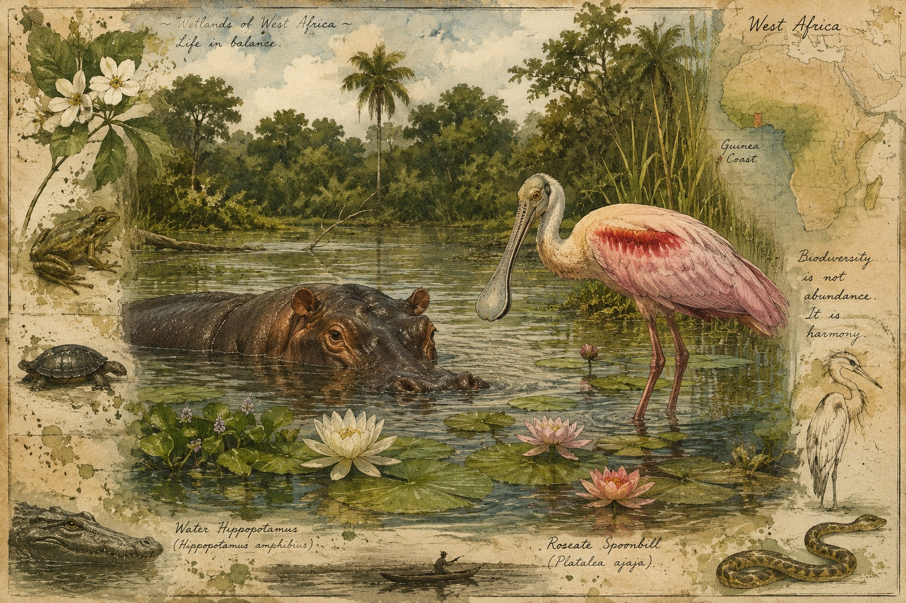

    color: #8b0000 !important;            /* Deep crimson red for titles */
  }
</style>

A chapter from Naked Steps: A Timeless Panoramic Ancestral Odyssey, a book by Woni Spotts

Along the Niger River and Sahel, early human migrations and prehistoric innovations rose into powerful kingdoms in West Africa. Through agriculture, commerce, and the trade of human cargo, empires in Ghana, Mali, and Songhai dominated the region. Words weave together the lush flora and fauna around the Trans-Saharan and Trans-Atlantic slave trades. The chapter explores crimes against humanity from Africa and the eastern Mediterranean into the Americas.

Deep in the delta, an egret sailed on a hippopotamus toward a willowy reed riverbank. Gentle currents carried snakes, frogs, and turtles on lily pads, duckweed, and water lettuce. Beneath a baobab tree, elephants basked, antelopes nibbled, and baboons swung from branch to branch. After a shift west across the sub-Saharan, Homo sapiens stepped into an illusion. The air shimmered under the heat as apex predators stalked closer and closer, c. 10,000 BCE.

Once sole merchants lined the Niger River, plant cultivation, animal domestication, and networks expanded into farms. Villagers provided grain, livestock, tools, crafts, and salt, c. 8,000-3,000 BCE. In the Nok Civilization, advanced terracotta sculptures and metallurgy appeared absent developmental phases or parallel traditions, c. 1,000 BCE. Adobe sun-dried mud-brick spiked Sudano-Sahelian structures added a 3D dynamic in Mali, notably—Timbuktu founded by Tuaregs, c. 1,100 CE, the Great Mosque of Djenné, c. 1,200 CE, and Sankore Madrasah, c. 1,300 CE.

Outdoor markets along the coasts displayed woven textiles, wooden sculptures, and carved masks. In the Sahelian Acacia Savanna, the Nomadic Wodaabe Fulanis livened the Gerewol festival, Yaake. Males dressed in ostrich feathers and elaborate makeup, competed for females, while females bartered or added mates. Starry nights complemented traditional drum circles. A griot ensemble with djembe, kora, and balafon added emotional depth to birth, marriage, and death occasions.

In a culinary saga, a Senegalese chef, Penda Mbaye, prepared a barley dish. When the grain dwindled, French colonists imported an Asian species of rice, peanuts, and tomatoes from the Americas. Thieboudienne or Jollof developed, c. 1,800-1,900 CE. Communal one-pots finished with fermented palm wine, kunu, zobo, bitter leaf tinctures, or psychoactive resins heightened intuition.

In the Ifa tradition, Orishas connected worshipers with Olodumare, the supreme creator. Seasonal ceremonies honored ancestors and offered blood sacrifices. Communal healers compounded plants and divined with cowrie shells or bones. Believers deified sculpted effigies, sacred bulls, rainbow serpents, and phallic symbols. Elders led prepubescent rituals—seclusion, scarification, and coitus virginal initiations—with a “hyena.” While virgins offered in shrines to fetishes atoned for familial sins, widows practiced levirate marriages. Possessed by Bori spirits—yan daudu—males entertained dressed as women.

Khalidurat, a Nubian Christian king in Makuria, signed the Baqt or Bakht treaty presented by Abdallah Ben Said, a Muslim military leader from Egypt. The agreement utilized established Trans-Saharan routes and led to further bondage, c. 652 CE. The Niger River acted as a serpentined cord through the Golden Age of West African empires—Ghana, Songhai, and Mali, ruled by Mansa Musa, c. 1,000-1,600 CE.

The Dahomey, Bonny, Kongo, Wolof, and Queen Nzinga/Matamba kingdoms, along with the empires of Ghana, Mali, Ashanti, Songhai, Bamana, and Oyo, dealt in gold, salt, ivory, and captives. In Lagos, a British colony, Madame Efunroye Tinubu traded palm oil, spices, salt, and the vanquished from lands around the Great Walls of Benin. On the other side of the continent, a Zanzibari Arab, Tippu Tip brokered ivory, firearms, textiles, and survivors from village raids.

Arab, African, and European operators of the Trans-Saharan slave trade broadened into the Trans-Atlantic slave trade. Powerful rulers and independent actors commodified “enemies,” sold in lots of forty for umbrellas, shells, alcohol, guns, and trinkets, c. 1,500 CE.

In the Memorial de Remedios para Las Indias, c. 1,516 CE, Bartolomé de las Casas advocated for the enslavement of Africans. Locked in chains, the abducted marched under guard from inland regions into dungeons. The Dahomey thrust the enchained toward the Tree of Forgetfulness. Shackled to prevent mutinies, prisoners walked through Doors of No Return onto ships headed for the Middle Passage. Pirates lurked nearby with skull and crossbones flags. An endless source of human chattel thrown from ships changed the migratory patterns of marine life.

In the Americas, threats of castration, mutilation, and tools of torture—thumbscrews, whips, muzzles, hot irons, and spiked collars—loomed. The unfortunate endured forced coitus, nude display on auction blocks, suicides, and cultural severance. Owners used infants as alligator bait and corpses as raw material for clothes, shoes, dentures, and oral “medicine.”

Decades later, propagandistic newspapers, railroads, and photographers coordinated to advertise, transport crowds, and create macabre souvenir postcards to document violent spectacles. Lynch mobs—with children present—gathered for blood sacrifices, removed fingers, toes, ears… as “trophies,” and participated in festive ritual feasts, acts to assert dominance, absorb the vitality of the deceased, and forge an identity unified against Black humanity.
